# 12306 座位分配算法

## 动机

12306 是人们日常生活中常用的 app, 每逢节假日, 当我们输入日期、起点站、终点站查询时, 经常会看到一些线路车次有 “剩余票数xx张” 的提示. 那么 12306 的车票库存扣减逻辑是怎样的呢? 当我们买多张连座车票时, 12306 又是怎么分配座位的? 这是我写这篇文章的动机.

## 车票的实质

我们将以如下线路作为例子展开.


物理世界里, 列车的座位数是固定的, 如果一条线路只有两个站点, 那么座位数便是票数.

> 如果以影院选座类比, 将一个「车次」对应一个「场次」, 那么我们会发现一个明显的区别
>
> - 一个车次, 假设其线路是 「哈尔滨(始发站)→广州(终点站)」, 用户的上下车站点, 可以是线路中途的任意两个站点. 比如 「哈尔滨→北京」,「石家庄→郑州」, 「武汉→长沙」...
> - 一个电影场次, 用户购票时则只能选「电影开始~电影结束」, 未曾有只购买影片中一个片段的票的.

而如果一条线路有多个站点, 这个时候“车票库存”的定义则不再那么清晰. 乘客可以在线路上选取任意两点作为起点站、终点站.

- Alice 要买 「西安→上海」 的车票
- Bob 要买 「洛阳→郑州」 的车票
- Cindy 要买 「南京→上海」 的车票
- ...

此时, 给予 “车票库存” 一个清晰的定义变得迫切.

```mermaid
gantt
    title Alice、Bob、Cindy 的行程区间
    dateFormat X
    axisFormat %

    section Alice
    西安-上海   : 1, 5
    section Bob
    洛阳-郑州   : 2, 3
    section Cindy
    南京-上海   : 4,5
```



我们将座位占用情况投射到柱形图上, 会发现座位的状态(空闲/占用)与行程相关, 不同的乘客可以占用一个座位, 只要他们的行程区间不冲突.
> 上面的例子中, Bob 与 Cindy 是可以被分配同一个座位的.

在一个车次的运行过程中, 伴随着乘客们的上与下, 座位的状态也在占用/空闲之间切换. 我们不能说一个“车次有多少空闲座位", 而应该说“车次中某个行程区间有多少空闲座位”.

换言之, 空闲座位的的数量(即票数)是按 「行程区间」这个维度来统计的.

行程区间是可枚举的, 从线路上任意一个站点都可以去往之后的站点, 于是可以列出如下表格:

| **终点👇/起点👉** | 西安(1) | 洛阳(2) | 郑州(3) | 南京(4) | 上海(5) |
|---------------|-------|-------|-------|-------|-------|
| **西安(1)**     |       |       |       |       |       |
| **洛阳(2)**     | X    |       |       |       |       |
| **郑州(3)**     | X    | X    |       |       |       |
| **南京(4)**     | X    | X    | X    |       |       |
| **上海(5)**     | X    | X    | X    | X    |       |

表格中, 标记为 “X” 的格子都是一个可选的站点区间.

我们假设列车有 100 个座位, 初始情况下, 从任意站点去往(行进方向的)后续站点的车票库存都为 100.

| **终点👇/起点👉** | 西安(1) | 洛阳(2) | 郑州(3) | 南京(4) | 上海(5) |
|---------------|-------|-------|-------|-------|-------|
| **西安(1)**     |       |       |       |       |       |
| **洛阳(2)**     | 100    |       |       |       |       |
| **郑州(3)**     | 100    | 100    |       |       |       |
| **南京(4)**     | 100    | 100    | 100    |       |       |
| **上海(5)**     | 100    | 100    | 100    | 100    |       |

Alice 购买了「西安->上海」的票, 意味着整条线路的所有子区间都会少一个座位,也即是, `[西安,上海)` 集合中的所有子集, 座位都会被占用一个. 于是 Alice 购票时, 需要扣减所有 `[西安,上海)` 内的所有子区间的车票库存.

| **终点👇/起点👉** | 西安(1) | 洛阳(2) | 郑州(3) | 南京(4) | 上海(5) |
|---------------|-------|-------|-------|-------|-------|
| **西安(1)**     |       |       |       |       |       |
| **洛阳(2)**     | <font color=green>99 ↓1</font>    |       |       |       |       |
| **郑州(3)**     | <font color=green>99 ↓1</font>    | <font color=green>99 ↓1</font>    |       |       |       |
| **南京(4)**     | <font color=green>99 ↓1</font>    | <font color=green>99 ↓1</font>    | <font color=green>99 ↓1</font>    |       |       |
| **上海(5)**     | <font color=green>99 ↓1</font>    | <font color=green>99 ↓1</font>    | <font color=green>99 ↓1</font>    | <font color=green>99 ↓1</font>    |       |

Bob 购买了 「洛阳->郑州」 的车票, 形成区间 `[洛阳,郑州)`,与之存在交集的区间为:

- `[西安,郑州)` ∩ `[洛阳,郑州)` = `[洛阳,郑州)`
- `[洛阳,郑州)` ∩ `[洛阳,郑州)` = `[洛阳,郑州)`

于是 `[西安,郑州)` 、`[洛阳,郑州)` 的车票库存扣减1:

| **终点👇/起点👉** | 西安(1) | 洛阳(2) | 郑州(3) | 南京(4) | 上海(5) |
|---------------|-------|-------|-------|-------|-------|
| **西安(1)**     |       |       |       |       |       |
| **洛阳(2)**     | 99    |       |       |       |       |
| **郑州(3)**     | <font color=green>98 ↓1</font>    | <font color=green>98 ↓1</font>    |       |       |       |
| **南京(4)**     | 99    | 99    | 99    |       |       |
| **上海(5)**     | 99    | 99    | 99    | 99    |       |

Cindy 购买了「南京->上海」的车票, 形成区间 `[南京,上海)`, 与之存在交集的区间为:

- `[南京,上海)` ∩  `[南京,上海)` =  `[南京,上海)`

于是 `[南京,上海)` 区间的票数扣减 1 .

| **终点👇/起点👉** | 西安(1) | 洛阳(2) | 郑州(3) | 南京(4) | 上海(5) |
|---------------|-------|-------|-------|-------|-------|
| **西安(1)**     |       |       |       |       |       |
| **洛阳(2)**     | 99    |       |       |       |       |
| **郑州(3)**     | 98    | 98    |       |       |       |
| **南京(4)**     | 99    | 99    | 99    |       |       |
| **上海(5)**     | 99    | 99    | 99    | <font color=green>98 ↓1</font>   |       |

当 Alice、Bob、Cindy 买完票后, 车次的每个站点区间车票库存情况如上图.

## 定义一些数据结构

为了算法的展开, 我们需要先明确一下数据结构.

### 车厢座位布局

我们需要一个二维数据结构来表达车厢座位布局, 存储形态不是我们关心的, 但是加载到内存中, 经过处理后, 要能得到一个二维对象数组, 每个对象拥有一些属性, 能标明座位的类型、级别等.

```txt
                                一等座区域   
           A           C                    D         F       
     +-----------------------------------------------------+  
     |  +-----+    +-----+              +-----+   +-----+  |  
     |  |  1  |    |  2  |              |  3  |   |  4  |  |  
     |  +-----+    +-----+              +-----+   +-----+  |  
     +-----------------------------------------------------+  
窗                             二等座区域                         窗
            A	   B      C                 D        E	
     +-----------------------------------------------------+
     |  +-----+ +-----+ +-----+           +-----+ +-----+  |
     |  |  5  | |  6  | |  7  |           |  8  | |  9  |  |
     |  +-----+ +-----+ +-----+           +-----+ +-----+  |
     |                                                     |
     |  +-----+ +-----+ +-----+           +-----+ +-----+  |
     |  | 10  | | 11  | | 12  |           |  13 | | 14  |  |
     |  +-----+ +-----+ +-----+           +-----+ +-----+  |
     +-----------------------------------------------------+
                                   过道                      
```

### 线路

我们需要一个链式结构来表达一条 **线路**, 每个节点代表一个站点.


### 车次

车次基于「载客交通工具」(决定车厢座位布局)和「线路」创建.

### 站点区间

当创建一个「车次」后, 便可得出线路中可能的站点区间. 基于前面「线路」的示例, 可以枚举出站点区间如下:

- 北京 → 武汉
- 北京 → 深圳
- 武汉 → 深圳

### 车票

一张「车票」是在一个「站点区间」内对一个「座位」的使用权的契约. 用户购买一张车票后, 关联的「乘车人」便有了一条「车票」的记录.

### 车票库存

按照我们例子里的「车厢座位布局」 可得到每个「站点区间」的初始车票库存:

站点区间|票数
--|--
北京→武汉|一等座=4, 二等座=10
北京→深圳| 一等座=4, 二等座=10
武汉→深圳| 一等座=4, 二等座=10

> 以上数据应该创建车次时生成, 写入车票库存表

## 明确一些产品设计

在数据配置阶段完成后, 下一步要考虑的就是用户购票了. 在这之前, 我们需要明确一些产品交互层面的问题, 因为这会影响我们的算法实现.

### 选座界面的交互

第一个需要考虑的问题是, 选座界面应该展示什么给用户?

1. 展示所有座位
2. 展示座位类型
    > 列车的车厢会对每一排座位标明 A、B、C、D、E, 这些字母可看作座位的「类型」属性, 类型可用于区分座位靠窗、靠过道、居中等空间信息.

如果是电影院选座, 用户通常会非常在意座位的「排」 和 「列」, 因此必须要把全部座位的二维结构展示给用户选择.

而对于列车选座,

- 一来, 用户只关心座位的级别(一等、二等)、是否靠窗、靠过道、居中, 而不在意处于列车的第几排.
- 二是, 列车的座位可达几百上千个, 这个二维结构展示在手机上并不太友好.

综合来看, 选择只展示座位类型是更好的选择.

本例中, 我们定义 5 种座位类型, 每个车厢的座位在被创建的时候, 都会赋予一个「类型」属性.

类型名称| 是否靠窗|是否靠过道| 排序值
--|--|--|--
A|左侧|否|1
B|否|否|2
C|否|右侧|3
D|否|左侧|4
E|右侧|否|5

按照上表中对「类型」的定义, 那么对于二等座的一排座位, 各自的类型如下图所示:

```txt
+-----+    +-----+           	   +-----+   +-----+
|  A  |    |  C  |           	   |  D  |   |  E  |
+-----+    +-----+           	   +-----+   +-----+
```

同样地, 对于二等座的一排座位, 各自的类型如下图:

```txt
+-----+ +-----+ +-----+         +-----+ +-----+
|  A  | |  B  | |  C  |         |  D  | |  E  |
+-----+ +-----+ +-----+         +-----+ +-----+
```

当用户选择座位后, 前端将用户勾选的「类型列表」传递给后端. 后面就是后端的表演了.

> 你可能会想, 假如用户的「乘车人」很多, 比如有 6 个乘车人不够选怎么办? 很简单重复展示就行了, 比如要买 6 张一等座的票, 那么我们重复展示 2 行 A、C、D、E 即可. 后端的选座算法关心的是: 用户选了哪些类型的座位, 以及是否连续.

## 座位分配算法

输入:

- 车次
- 站点区间
- 座位列表
  - 座位级别
  - 座位类型
  - 乘车人

### 1. 确定座位二维状态图

由于偏好设置的存在, 用户对买到的座位的位置(如靠窗、靠过道)有要求, 当买多张票时, 用户还可能希望买到连座.

要满足这些偏好设置, 必须先知道「列车」在用户所选的「车次」的「站点区间」内的所有座位的二维结构, 以及每个座位的状态.

「二维状态图」可通过如下两步得到:

1. 查出列车的所有座位的二维结构.
2. 查出「站点区间」内哪些座位以及被占用了.

这里可以举一个例子说明, 假设「车次」下有购票记录(即车票)如下:

乘车人|上车站点 | 下车站点 | 座位
---|---|---|---
甲 |北京  | 武汉 | 5
乙 |北京  | 深圳 | 6

将表格数据投射到柱状图后如下:

```mermaid
---
displayMode: compact
---
gantt
    title 座位占用情况
    dateFormat X
    axisFormat %
        购票区间开始                 :milestone, 2,2
        购票区间结束                 :milestone, 3,3
    section 甲
    北京→武汉,占用座位5   : 1, 2
    section 乙
    北京→深圳,占用座位6   : 1, 3
```



假设现在用户请求购买站点区间 「武汉→深圳」的票, 通过上图我们可以清楚地看出, 这个区间只有「乘车人乙」占用了 「座位 6」.

> 乘车人「甲」在「站点武汉」下车了, 所以 「5号座位」是空闲.

于是可得到区间「武汉→深圳」的座位状态图如下, 其中标记 「X」的表示为区间内被占用的座位.

```txt
                                一等座区域   
           A           C                    D         F      
     +-----------------------------------------------------+ 
     |  +-----+    +-----+              +-----+   +-----+  | 
     |  |  1  |    |  2  |              |  3  |   |  4  |  | 
     |  +-----+    +-----+              +-----+   +-----+  | 
     +-----------------------------------------------------+ 
窗                             二等座区域                         窗
            A	   B      C                 D        E
     +-----------------------------------------------------+
     |  +-----+ +-----+ +-----+           +-----+ +-----+  |
     |  |  5  | |  X  | |  7  |           |  8  | |  9  |  |
     |  +-----+ +-----+ +-----+           +-----+ +-----+  |
     |                                                     |
     |  +-----+ +-----+ +-----+           +-----+ +-----+  |
     |  | 10  | | 11  | | 12  |           |  13 | | 14  |  |
     |  +-----+ +-----+ +-----+           +-----+ +-----+  |
     +-----------------------------------------------------+
                                   过道 
```

上图中, 除了 「X」 之外的座位, 都是在 「武汉→深圳」区间内空闲的座位.

我们对上述过程归纳一下, 会发现其实就是「取交集运算」, 算出指定站点区间下, 有哪些座位卖出去了.

比如上面例子中, 「车票表」中的每一条记录都有 「上车站点」、「下车站点」 构成了一个区间, 当我们要检查某个区间 `[武汉,深圳)` 下哪些座位卖出去了, 就可以通如下 sql 取交集得到.

```sql
select 座位 from 车票表 where 上车站点<深圳 and 下车站点>武汉
```

### 2. 座位匹配

通过上一步, 我已经可以拿到「任意车次」的「任意站点区间」的「座位二维状态图」.在这之后所, 我们的算法需要在满足「用户偏好」的前提下分配座位.

座位匹配的过程本质就是「子串匹配问题」.

- 「座位二维状态图」可看作是一个字符串, 比如我们的例子中, 二等座区域有两排 `ABCDE` 座位, 可表达为字符串 `"ABCDEABCDE"`.
- 用户的输入是一个座位类型序列也可看作一个字符串, 比如用户要买靠窗的连座`"AB"`

用字符串 `"AB"` 去匹配 `"ABCDEABCDE"`, 如果遇到一个匹配子串, 且子串中每个字符(座位)为 「空闲」, 那么就意味着有座位分配成功, 否则意味着没有满足用户偏好的空闲座位.

一个标准的字符串匹配算法代码如下:

```java
    public int strStr(String haystack, String needle) {
        int idx = 0;
        int beginIdx = 0;
        int endIdx = 0;

        while (idx < needle.length() && endIdx < haystack.length()) {
            if (haystack.charAt(endIdx) == needle.charAt(idx)) {
                endIdx++;
                idx++;
            } else {
                endIdx = ++beginIdx;
                idx = 0;
            }
        }

        if (idx == needle.length()) {
            return beginIdx;
        } else {
            return -1;
        }
    }
```

与单纯的「子串匹配问题」的唯一区别是, 用户可能会选择「非连座」, 比如 `"ABCDEF"`, 用户选择了 `"AC"`, 这种情况需要跳过 `"B"` .

```java
class Seat {
        int id;
        String type;
        boolean isFree;
}

static Seat[] allocate(Seat[] seats, String[] selected) {
        int idx = 0;

        //匹配窗口
        int beginIdx = 0;
        int endIdx = 0;

        while (idx < selected.length && endIdx < seats.length) {
                var seat = seats[endIdx];
                if (seat.type.equals(selected[idx])) {
                        if (seat.isFree) {
                                idx++;
                                endIdx++;
                        } else { //类型匹配成功, 但是状态为「被占用」, 那么当前匹配失败, 进入下一轮匹配
                                idx = 0;
                                endIdx = ++beginIdx;
                        }
                } else {
                        endIdx++; //匹配不成功时跳过
                }
        }

        if (idx == selected.length) {
                //取出匹配到的座位
                Seat[] result = new Seat[selected.length];
                for (int i = 0; i < selected.length; i++) {
                        result[selected.length - i - 1] = seats[--endIdx];
                }
                return result;
        } else {
                return null;
        }
}
```

如下测试代码中, 假设有两排类型为 `ABCDEF` 的座椅, 用户希望购买连座 `AB`,  由于第一排座椅的 `B` 被占用, 所以最后分配第二排的 `"AB"`, 也即是 5号、6号座椅.

```java
@Test
public void test2() {
        Seat[] allSeats = new Seat[]{
                         // 第一排
                        new Seat(0, "A", true),
                        new Seat(1, "B", false), //此座位被占用
                        new Seat(2, "C", true),
                        new Seat(3, "D", true),
                        new Seat(4, "E", true),
                        //第二排
                        new Seat(5, "A", true),
                        new Seat(6, "B", true),
                        new Seat(7, "C", true),
                        new Seat(8, "D", true),
                        new Seat(9, "E", true),
        };

        Seat[] seatsBought = allocate(allSeats, new String[]{"A", "B"});

        Assertions.assertArrayEquals(new Seat[]{allSeats[5], allSeats[6]}, seatsBought);
}
```

## 并发控制

限流

MQ

事务

## 数据治理

## 后记
