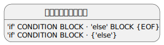

# 编译原理-关于语法分析中的结合方向与优先级问题

在开始之前,先明确一下,什么是优先级、结合方向是必要的.

***什么是结合方向***

以减法运算 a-b-c-d  为例,其结合过程为:

1. a-b 先结合
2. (a-b) 的结果与 c 结合, 形成 (a-b)-c
3. ((a-b)-c) 的结果与 d 结合, 形成 ((a-b)-c)-d

由于左边的减法表达式总是先结合,因此我们会说,减法表达式是左结合的. 

结合方向会影响生成的语法树,进而影响语法树的求值结果. 下图对比了减法表达式,左结合与右结合时所生成的语法树的区别. 可以看到,右结合时得到的是 a-(b-(c-d)), 显然会导致错误的运算结果.


***什么是优先级***

与结合方向不同在于,结合方向是某一个表达式的独立性质,而优先级,则是指的多个表达式之间的结合先后顺序. 我们会说,加法表达式、乘法表达式具有左结合的性质, 但是两者同时出现时,后者求值优先级更高,所以乘法应该优先结合. 

更完整地说,语法分析中,“优先级”指的是不同产生式之间的结合优先级(有了比较才有了优先级). 而“结合方向”是产生式的独立性质, 不需要比较.在语法分析中,通常只有在所设计的文法存在二义性时,才需要设置优先级.

下文将以算术表达式文法、IF语句文法为例,分析关于优先级、结合方向问题的通用解决方案.

## 算术表达式中的结合方向与优先级问题

我们声明一个只支持加法和乘法运算的算术表达式文法:

```bnf
E -> digit '+' E | digit '*' E | digit
```

输入 1 * 2 + 3 ,我们将得到一个 `a*(b+c)` 的错误的树:


直觉上,我们可能会把责任归咎于,文法中的非终结符 E 的产生式体是右递归的,导致总是优先结合右边的部分.这是一个错误直觉,为了厘清这个反直觉现象的根本原因,可以先尝试把文法改写成左递归:

```bnf
E -> E '+' digit | E '*' digit | digit
```

以上文法,输入 `1 * 2 + 3`,分析结果是: (1 * 2) + 3 , 这是符合预期的.


但如果我们换一下两个加数的顺序, 把`1 * 2` 与 `3` 交换, 输入`3 + 1 * 2`, 那么将得到一个出人意料的结果 `(3+1)*2`, 显然这不符合加法交换律.


***总结出问题的根本***

我们会发现,通过调整文法的递归方向,确实可以影响结合方向. 以上例子中,一开始,文法是右递归的,表达式总是右边的先结合,生成的树向右边生长; 而左递归时,表达式总是左边的先结合,生成的树则总是偏向左.

但问题在于,加法表达式、乘法表达式 具有不同的优先级. 无论输入序列中,乘法表达式在左边还是右边,其都应该优先结合. 反观上面提到的,左递归、右递归文法,其只会按“谁前谁后”来决定结合的方向,当我们把 `a+b*c` 改成 `b*c+a` ,会产生两种不同的结合方式, 继而生成不同的语法树.

所以,对这一问题,靠调整递归方向而改变结合方向是不行的. 问题的根本不在于结合方向,而在于,优先级,乘法表达式的优先级应高于加法. 有两种解决方式下面会一一讲解.

***通过调整文法解决优先级问题***

一种办法是,将乘法运算和加法运算拆分,其思路是,既然乘法表达式优先结合,那么索性将其放在加法表达式的前面分析,先分析的表达式必然先结合,调整后的文法如下:

```
MUL -> digit | digit '*' MUL
ADD -> MUL | MUL '+' ADD
S -> ADD
```

基于以上文法,对前文提到两个输入序列作分析,均可得到正确的语法树结构.

- 输入 `1 + 2 * 3` , 将得到 1+(2*3)
- 输入 `2 * 3 + 1` , 将的到 (2*3)+1

***通过设置产生式的优先级(LR算法支持)***

另一种是是借助 LR 算法的预测分析能力,写出可左右递归的文法,然后通过设置优先级,来告知 Parser Generater 谁先结合.

 为了更好地暴露问题的本质,这里我们先改写左右递归文法:

```bnf
E -> E+E | E*E | digit
```

尝试对该文法生成LR自动机,并输入 `1+2*3`,可推导出如下状态:


以上情况被称为 **移入规约冲突**, 对于这种二义性文法,需要手动指定`E->E+E`,`E->E*E` , 谁的优先级更高. 一般而言, Parser Generater 均会提供这种能力. 例如,作者本人所写一个 toy 级别 parser generator 👉 [GitHub: A Parser Generator](https://github.com/light0x00/parser-generator)

> 本质上,LR自动机是一个DFA, 对于一个输入符号只能有一个后继状态, 这是无回溯的前提.

## IF语句的优先级问题

```bnf
BLOCK -> IF | STATEMENT
IF -> 'if' CONDITION BLOCK 'else' BLOCK | 'if' CONDITION BLOCK
S -> IF
```

对这个文法生成LR自动机,会发现存在一个如下状态,当 lookahead 为 "else" 时,存在移入规约冲突:



更直观地讲,对于如下输入:

```bnf
if CONDITION 
	if CONDITION
		STATEMENT
	else  👈这里存在移入规约冲突
		STATEMENT
```

在位于 else 处, 存在两种选择:

- 如果选择将内层 IF 归约,那么 else 会跟随第外层 IF
- 如果选择移入 else,那么 else 会跟随第内层 IF

这两种选择生成的语法树分别如下:


显然,后者是我们希望的, else 应遵循就近原则,跟随第内层 IF.

这其实是一个优先级问题. `IF -> 'if' CONDITION BLOCK 'else' BLOCK ` 的优先级应高于 `IF -> 'if' CONDITION BLOCK`,有两种方式实现:

- 如果是手写递归下降的Parser,那么只需要在编码时优先移入即可.
- 如果是 Parser Generater 生成的 Parser,那么设计文法时,可手动指定 IF 语句的两个产生式各自的优先级.
