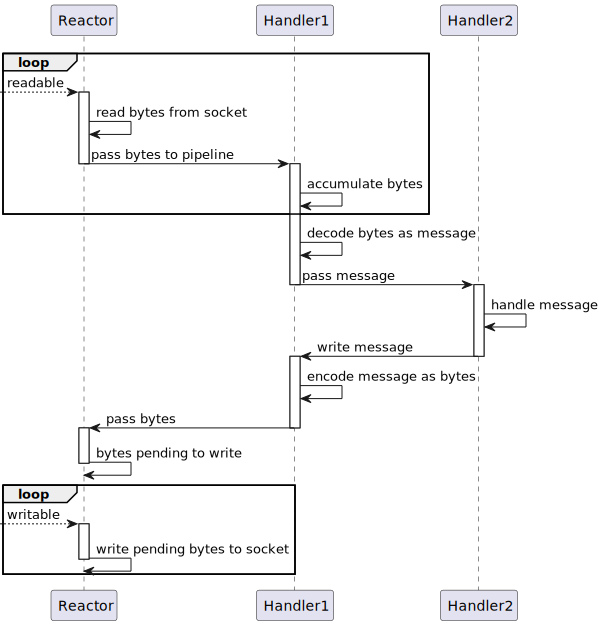
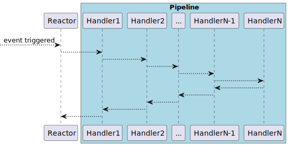
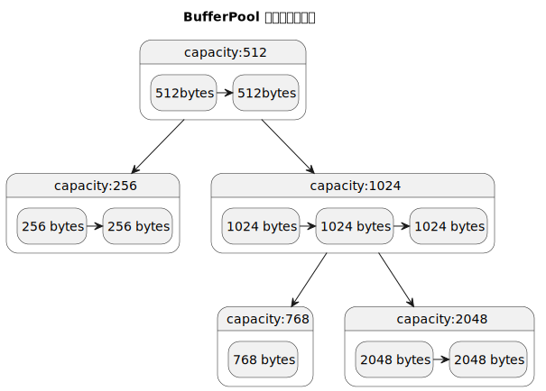

# 如何设计一个网络框架

这些年来, 有很多名词萦绕于耳, 异步、非阻塞、事件驱动、I/O 多路复用、事件循环、epoll, 乃至新近的 io_uring... 难免让人迷失在一个个概念之中, 这些概念形成了一座座孤岛, 终究难以构成体系.

于是, 我决定写些什么...

技术「八股文」化, 是我所要避免的, 这毫无灵性可言. 于是, 我写了一个网络框架 [Lighty](https://github.com/light0x00/lighty).

## 整体架构

Lighty 基于 Multiple Reactors 模式实现, 其设计思想受启发于 Doug Lea 的 [Scalable I/O in Java](https://gee.cs.oswego.edu/dl/cpjslides/nio.pdf).
`Acceptor` 接收连接, 并负载均衡分发给 Reactor Group 中的一个 `Reactor`

```txt
                                                 Reactor Group
                                                ┌─────────────┐
                                                │             │
                                                │  Reactor1   │
                                                │             │
                                                │  Reactor2   │
 acceptable   ┌──────────────────┐ load-balance │             │
────────────► │ Acceptor Reactor │ ───────────► │  ...        │
              └──────────────────┘              │             │
                                                │  ReactorN-1 │
                                                │             │
                                                │  ReactorN   │
                                                │             │
                                                └─────────────┘
```

`Reactor` 负责处理底层 I/O 事件, 将输入性事件传递给 `Pipeline`, 并接收来自 `Pipeline` 的输出性请求. 底层 I/O 事件、`Reactor`、`Pipeline`, 三者之间形成环形数据流.

```txt
                                                     inbound pipeline(A set of ChannelHandlers
           ┌────────────┐              ┌─────────────────────────────────────────────────────────────┐
readable   │┌─────────┐ │  input data  │ ┌──────────┬──────────┬─────────┬─────────────┬───────────┐ │
────────►  ││in buffer│ │   ───────►   │ │ handler1 │ handler2 │  。。。  │ handlerN-1  │  handlerN │ │
           │└─────────┘ │              │ └──────────┴──────────┴─────────┴─────────────┴───────────┘ │
           │            │              └─────────────────────────────────────────────────────────────┘
           │            │
           │            │                                           │
           │  Reactor   │                                           │ write
           │            │                                           ▼
           │            │              ┌─────────────────────────────────────────────────────────────┐
writable   │┌──────────┐│ output data  │ ┌──────────┬────────────┬─────────┬───────────┬───────────┐ │
────────   ││out buffer││   ◄───────   │ │ handlerM │ handlerM-1 │  。。。  │ handler2  │  handler1 │ │
           │└──────────┘│              │ └──────────┴────────────┴─────────┴───────────┴───────────┘ │
           └────────────┘              └─────────────────────────────────────────────────────────────┘
                                                    outbound pipeline(A set of ChannelHandlers)
```

## Pipeline

应用层所需要做的事可抽象为 5 个步骤:

```txt
 read ──► decode ──► compute ──► encode ──► write
```

在 Lighty 中, 使用 `pipeline` 作为这一过程的抽象. `pipeline` 由若干个 `Channelhandler` 组成, 每个 `Channelhandler` 负责处理来自上游的“状态”, 并决定是否传递处理结果到下游.

下图展示一个包含 2 个 `ChannelHandler` 的 pipeline, 接受输入, 返回输出 的交互过程.

0. `readable event` 触发
1. `Reactor` 从 `Channel` 中读出数据, 传递给 `Handler1`.
2. `Handler1` 积聚足够的字节后, 「decode」 出完整应用层报文, 并传递给 `Handler2`.
3. `Handler2` 接收到报文后, 执行 「compute」处理报文, 然后输出(写入)响应报文.
4. `Handler1` 将响应报文「encode」后, 传递给 `Reactor`.
5. 在下一个 `writtable event` 中, `Reactor` 将数据实际写入 `Channel`.



## 线程模型



Lighty 支持多线程池隔离, 即「专池专用」, 如上图所示, 从 `Reactor` 开始到 `Pipeline` 中的每一个 `Handler` 都可以指定使用不同的线程池.

一个 Channel 的处理链路中, 上下游之间以异步方式调用和返回. 上游调用下游, 实质上是向下游的线程池 produce 了一个任务, 下游被执行后再通知上游.

这里面有一个问题是, 如果使用传统的线程池, 那么上游每次调用下游, 下游的线程池可能会使用不同的线程去执行逻辑.这是因为线程池只有一个任务队列, 投进去的任务会被负载均衡给 Worker 线程.

一个 `Handler` 每次被不同的线程执行, 会带来诸多线程安全问题, 如变量的可见性、安全发布、竞争条件( Race condition ), 解决这些问题既增加了编码复杂度, 也会引入锁竞争, 降低了程序的整体活跃性.

```txt
                                                               +----------+                              
                                                               | Worker1  |                              
                                                               |          |                              
  produce         +------------------+     load-balance        |          |                              
---------->       |    task queue    |    -------------->      | ....     |                              
                  +------------------+                         |          |                              
                                                               | WorkerN  |                              
                                                               |          |                              
                                                               +----------+       
```

Lighty 中在传统线程池的基础上做了一些「加工」, 使得每个 Worker 都有一个自己的任务队列, 这确保了**投递的任务始终被一个确定的线程执行**.

```txt
   produce       +------------------+      consume                                 
----------->     |    task queue    |    --------->     Worker1                                  
                 +------------------+                                                        
                     ...                                ....                                        
   produce       +------------------+      consume                                                  
----------->     |    task queue    |    ---------->    WorkerN                                  
                 +------------------+                      
```

因此, Lighty 可以绝对地保证, 对一个 Channel 的处理逻辑, 是全链路 **线程封闭** ( Thread confinement ) 的.

## 异步化

在 Lighty 中, 一切可能阻塞的调用都是异步的, 通过异步回调的方式返回结果.

- bind, 监听一个 address
- connect, 连接一个 adress
- write, 写入数据到 socekt
- close\shutdownInput\shutdownOutput, 关闭 Socket
- pipeline 上下游通信
- even-loop 关闭

Lighty 中使用 `ListenableFutureTask` 来实现线程间异步通信. 外界通过 `addListener` 注册回调, 从而接收执行结果. 一个典型的使用方式如下:

```java
//1.执行异步任务
ListenableFutureTask<byte[]> future = doSomethingAsync();

//2.注册任务回调
future.addListener(f -> {
    if (f.isSuccess()) { 
        byte[] bytes = f.get(); //如果成功, 取出结果
    } else { 
        f.cause().printStackTrace(); //如果失败, 打印异常
    }
});
```

究其原理, `ListenableFutureTask` 继承了 juc 中的 `FutureTask`, 基于其中的 hook 方法 `done` 实现, 每当任务结束, 回调所有注册的 `Listener`.

```java
    /**
     * Protected method invoked when this task transitions to state
     * {@code isDone} (whether normally or via cancellation). The
     * default implementation does nothing.  Subclasses may override
     * this method to invoke completion callbacks or perform
     * bookkeeping. Note that you can query status inside the
     * implementation of this method to determine whether this task
     * has been cancelled.
     */
    protected void done() { }
```

## 缓冲区

Java 中的 `ByteBuffer` 只有单个指针, 每当写后读或读后写, 都需要先 `flip`, 在跨上下文传递时使用, 这将会是一个灾难. 不同上下文之间, 需要就 “上/下游是否会 flip” 这一问题而在代码中引入 “隐式的约定”.

Lighty 采用双指针的 `RingBuffer`, 解决了这一痛点.

```txt
    readPosition    writePosition   
          │              │
  ┌───────▼──────────────▼──────────┐
  │ free  │  unread      │   free   │
  └───────┴──────────────┴──────────┘
```

应用层的报文, 通常分为「元数据」和「荷载」, 组装一个完整的报文通常无法提前预知「内存占用大小」, 所以需要通过「动态扩容」来分配合适的空间, 而这会引入「数组拷贝」的成本.

如果将多个「内存块」以、「链式结构」连接, 再利用 [Scatter/Gather I/O](https://www.oreilly.com/library/view/linux-system-programming/0596009585/ch04.html) 发起读写调用, 那么便可以避免多余的内存拷贝. 这便是 `LinkedRingBuffer`, 它通过串联多个 `RingBuffer` 来存储未知大小的数据, 而无需「扩容」与「拷贝」.

```txt
      read buffer      write buffer
          │                │
  ┌───────▼────┐    ┌──────▼─────┐    ┌────────────┐
  │ RingBuffer │───►│ RingBuffer │───►│ RingBuffer │
  └────────────┘    └────────────┘    └────────────┘
```

## 缓冲区复用

***动机***

在 NIO 框架层面, 每次 readable 事件到来, 都需要申请一块内存(`ByteBuffer`), 用于装载 Socket 中的就绪数据, 然后传给用户的 `ChannelHandler`. 这是一个非常频繁的动作, 如果每次都申请新的内存, 将在内核层面带来大量内存分配/回收开销, 在 JVM 层面产生频繁地 GC 开销.

- 如果使用堆外内存, 需要频繁地 `malloc/free`, 带来内存分配算法的开销, 以及更容易产生外部碎片(因为是高频地小段地申请内存).
- 如果使用映射内存, 需要频繁地 `mmap/munmap`, 带来 VMA 和页表的维护成本, 由于映射空间只是短暂使用就释放, TLB 的利用率降低.
- 如果使用 GC heap 内存, 那么内核层面的分配、释放开销较小(因为 JVM 可以批量向 OS 申请内存), 但是会频繁地生成 `byte[]` 对象, 增加 GC 开销.

**解决方案**

缓冲池需要对外提供两种操作:

```java
/**
 * 申请内存
 */
ByteBuffer take(int capacty);

/**
 * 回收内存
 */
void put(ByteBuffer);
```

可采用 Map 数据结构来作为“池子”, put 时将内存放入 Map, take 时从优先 Map 中取, 未取到则创建新的.

这里有一点需要注意, 假如池子里现存一个 capacity 为 6 的 `ByteBuffer`, 现需申请一个 capacity 为 5 的 ByteBuffer, 则应当复用现有的. 实现这一点, 我们需要一个支持排序, 可范围查找的数据结构, 可能的选择是: 平衡树 或 跳表. Lighty 中选择了平衡树(TreeMap).

> 在并发控制上, 跳表这种数据结构更适合以 lock-free 的方式实现, 这也是为什么 Java 有 ConcurrentSkipList 而未曾有 ConcurrentTreeMap 的原因. 但是由于 缓存池 的实现并不只依靠单个数据结构, 还需组合 LRU 的数据结构, 采用并发跳表的话, 需要考虑整体上 lock-free 的可行性, 计划在发布 1.0 之前深入调研和验证一下这个问题.

如下图, 树的每个节点代表一种“容量”, 使用一个链表存储容量为该值的 `ByteBuffer`, 当需要某种容量的 `ByteBuffer` 时, 比如要申请容量为 700 bytes 的 `ByteBuffer`, 那么从树中查找 >=700 bytes 的最小节点, 下图的例子中, 容量为 768 的节点会被命中, 最终从该节点的链表中取出 `ByteBuffer` 复用.



除此之外, 缓存池是有界的, 因此需要实现淘汰机制, 保留更常用的 `ByteBuffer`, 丢弃不常用的. “更常用”的可以有很多种解释, 比如 LRU 优先保留“最近使用”的, LFU 优先保留“使用总次数最多+最近使用”, Lighty 中选择了 LRU.
