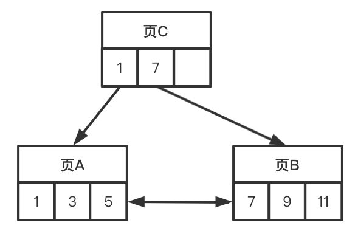
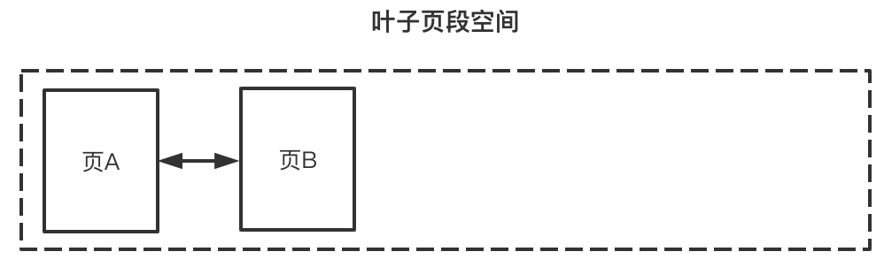

# InnoDB 顺序插入与乱序插入的区别

这个问题,可以先从 B+ 树的维护过程切入. 

B+树的一个节点(后称“页”)能存放的键值是有限的,假设一个节点最多存放3个键值,一开始向 B+ 树插入 1、3、5, 此时分配一个页 A 存放:

然后再插入7,9,11,由于我们限制了一个页最多存3个,所以需要分配页 B 来存放,并且还需要分配一个页 C 来存目录键值 1,7:

在下一步,插入 4,按照键值大小,它应该被放在页 A ,但是页 A 空间已经满了. 并且相邻页 B 也满了,所以只能创建一个新页 D 来存放. 而假如直接把 4 放入页 D,会破坏 B+ 树的有序性,如下图所示:

所以,需要把页 A 的 5 移到页 D,让页 A 就腾出空间来存放 4:

插入乱序数据 4 与之前插入顺序数据 1、3、4、7、9、11 不同的是, 虽然两者都产生了页分裂,但是前者除了页分裂,还产生了数据迁移(把5移到页 D 中). 

前面是从纯数据结构的层面分析得出,乱序插入会导致数据迁移,我们的例子里规定了一个页只有3条记录, 在 InnoDB 中,实际的一个索引页可能存放很多数据, 数据迁移带来的磁盘读写成本是可观的.

> 具体一个页能存多少记录,取决于页大小(默认16K),以及记录大小.

另一方面, InnoDB 会尽量让叶子页在磁盘上顺序存放,上面的例子中,一开始只有页 A,后面申请页 B、C, 由于页 A、B 是连续从分配的,所以在磁盘上顺序存放的概率比较大(InnoDB 会尽量让后一次分配的页和前一次分配的页顺序存放),假设页 A 和页 B 在磁盘上是顺序存放的,此时如果遍历叶子页记录,从页 A 到 B是顺序 IO,一切都很美好.

紧接着灾难来了,我们插入一条无序数据 4 ,这时 InnoDB 会继续从 叶子页段 分配一个页 D, 页 D 会顺序存放在上一次分配页 B 后面:

这时我们从页 A 开始向右遍历叶子页记录,逻辑上,A 的下一个页是 D,但物理上页 A 和 D 并不顺序存放,所以从 A 遍历到 D 是随机 IO.

## 总结

最后总结一下键值无序插入的坏处:

1. 在页分裂时,为了维持 B+ 树的有序性,需要迁移页中的部分记录,增加磁盘读写成本.
2. 叶子页构成的链表中,相邻页在磁盘上不是顺序存放的概率会变大.,遍历相邻叶子页时,随机 IO 更多.