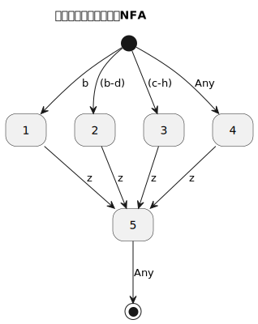

[返回目录](../index.md)

# NFA to DFA

## 子集构造法

思路: NFA 存在的问题在于,对同一个输入可能存在多个后继状态,其转换具有二义性. 所谓 "二义性" 换一种表述是 **"给定条件下存在多种可能"**. 如果化零为整,**将多种可能作为一个整体**,即把这多个可能的后继状态合为一个"大的状态"来看待,那么情况将会不一样.

具体来说,对于 `a*ab`,如下图:

在起点处,输入a可能的后继状态是 1、2, 那么就把1、2合为一个状态 A = $`\begin{Bmatrix} 1,2 \end{Bmatrix}`$

大状态 A 里, 状态 1、2 存在转换为 $`\begin{Bmatrix}
1 \xrightarrow{a} 1 \\
1 \xrightarrow{a} 2 \\
2 \xrightarrow{b} 3
\end{Bmatrix}`$ 将其聚合后得到 $`\begin{Bmatrix}
A \xrightarrow{a} \{1,2\} \\
A \xrightarrow{b} 3
\end{Bmatrix}`$

- 对于 $A \xrightarrow{a} \{1,2\}$ , 由于 {1,2} 已存在就是 A 自身所包含的 NFA 状态, 所以 $A \xrightarrow{a} A$ ;
- 对于 $A \xrightarrow{b} 3$ , 生成一个新的状态 B = $\begin{Bmatrix} 3 \end{Bmatrix}$, 得到 DFA 转换 $A \xrightarrow{b} B$  

大状态 B 里,状态 3 存在转换 $`\begin{Bmatrix} 3 \xrightarrow{EOF} Accept \end{Bmatrix} `$ , 得到 DFA 转换:  $B \xrightarrow{EOF} Accept$

至此,NFA 就变成了 DFA.

从表达的语义来看,DFA 与 NFA 并没有差别,如上例的 NFA 的转换:

$$start \xrightarrow{a} 1$$

$$start \xrightarrow{a} 2$$

其对应的 DFA 转换:

$$start \xrightarrow{a} \{1,2\}$$

事实上, 两者都表达了 "起点处输入a可能到达1或2". 但是在表达形式上, NFA 将这种二义性(或者说多种可能性)表现在**转换**上了; 而与之不同, DFA 将二义性表达在**状态**里, 多种可能性被聚合在状态里, 消除了转换的二义性.

如果不是计算机处理,而是人脑,其实潜意识里就已经存在那个 “NFA 转 DFA”的过程, 人脑可以“并发地”同时走多条路径. 这么看,DFA 转 NFA 其实是把人类的潜意识里存在的处理方式“教”给了计算机.

## 范围输入带来的二义性

工程实践与教科书的区别在于, 教科书总是假设一个理想环境, 而工程并非如此. 前文中讲 NFA 转 DFA 时, 其实忽略一个现实: "转换可以是针对一个范围的输入" .

上图是正则表达式 `(b|[b-d]|[c-h]|.)z` 对应的 NFA, 你会看到, 起点处的4条转换之间, 是存在“交集”的:

换言之,也即是对相同区间的输入存在一种以上的转换,这对于 NFA 没有什么问题, DFA 则不可接受.

针对这种情况, 在将 NFA 转换 DFA 时, 需要设计一个算法, 消除 NFA 中存在交集的转换的二义性, 算法过程如下:

上例中, 起点处存在如下 4 个转换:

$$
\begin{Bmatrix}
	[1] start\xrightarrow{b}1 \\
	[2] start\xrightarrow{b-d}2 \\
	[3] start\xrightarrow{c-h}3 \\
	[4] start\xrightarrow{Any}4 \\
\end{Bmatrix}
$$

我们把每个转换的输入区间看作一个集合, 对转换 1 与转换 2 输入区间作集合运算:

$$
\begin{Bmatrix}
转换1 - 转换2 = \{\} \\
转换2 - 转换1 = \{c \sim d\} \\
转换1 ∩ 转换2 = \{b\}
\end{Bmatrix}
$$

根据运算结果, 交集为 {b}, 所以 $start\xrightarrow{b}\{1,2\}$, 转换2的差集为 {c~d}, 所以 $start\xrightarrow{c-d}2$

合在一起, 于是得到了如下转换:

$$
\begin{Bmatrix}
start\xrightarrow{b}\{1,2\} \\
start\xrightarrow{c-d}2
\end{Bmatrix}
$$

下一步, 将转换 3 与上面两个一一作集合运算, 重复相同的处理逻辑, 得到:

$$
\begin{Bmatrix}
start\xrightarrow{b}\{1,2\} \\
start\xrightarrow{c-d}\{2,3\} \\
start\xrightarrow{e-h}3 \\
\end{Bmatrix}
$$

最后, 对转换4 与以上3个转换一一作集合运算, 得到:

$$
\begin{Bmatrix}
	start\xrightarrow{b}\{1,2,4\} \\
	start\xrightarrow{c-d}\{2,3,4\} \\
	start\xrightarrow{c-h}\{3,4\} \\
	start\xrightarrow{∞-a}4 \\
	start\xrightarrow{i-∞}4 \\
\end{Bmatrix}
$$

至此, 便消除了转换的二义性问题, 得到如下 DFA :

