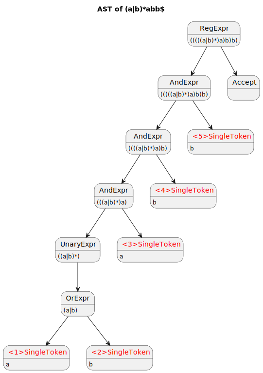
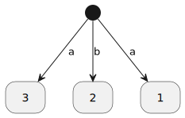
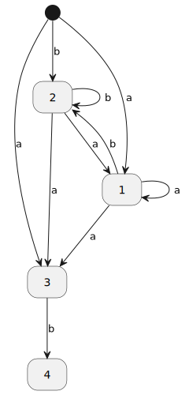
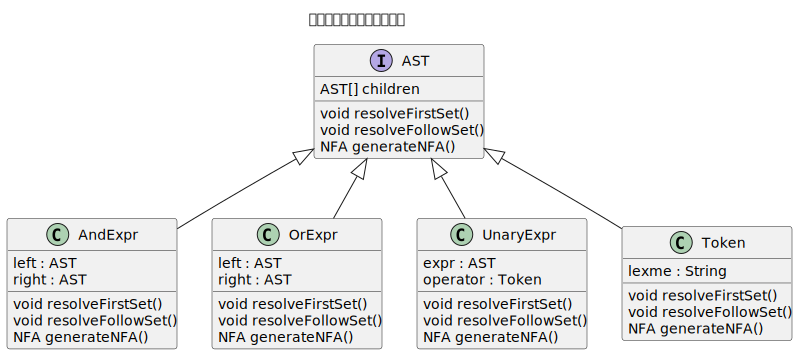
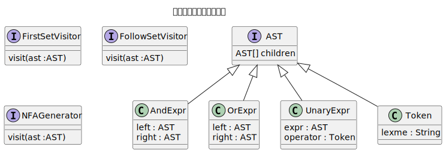

[返回目录](../index.md)

# 语义分析

经过语法分析阶段, 对于给定的一个正则表达式, 可以得到其对应的**抽象语法树(Abstract Syntax Tree)**, 而语义分析阶段要做的, 就是对这棵树进行遍历分析, 以达成相应目的.

正则引擎的语义分析, 目的是要得到 **AST** 对应的 **NFA(Non-deterministic finite automata)** , 以便在下一步交给**子集构造法(Subset Construction Method)**.

## AST to NFA 的基本过程

NFA 由 **状态(NStates)** 和 **转换(NTrans)** 构成, AST 转 NFA 的过程, 其实就是做两件事, 一是确定 NFA 的状态有哪些, 二是确定状态间的转换.



上图是 `(a|b)*abb` 对应的 AST, 为了便于描述, 叶子节点都打上了标号. 如果人工进行分析, 不难看出, 如果从 NFA 的起点出发, 存在如下状态转换:

$`\begin{cases}
	start \xrightarrow{a} 1 \\
	start \xrightarrow{b} 2 \\
	start \xrightarrow{a} 3
\end{cases}`$
<!-- -   $start \xrightarrow{a} 1$
-  $start \xrightarrow{b} 2$
-  $start \xrightarrow{a} 3$ -->

换言之, 1,2,3 这三个节点都是 NFA 首个状态, 于是, 得到如下 NFA :



下一步,要考虑的是, 状态 1、2、3, 分别存在哪些转换. 由于是上帝视角(人工分析), 所以很容易得出答案:

- 状态1 $`\begin{cases}
		1 \xrightarrow{a} 1 \\
		1 \xrightarrow{b} 2 \\
		1 \xrightarrow{a} 3
	\end{cases}`$

- 状态2 $`\begin{cases}
			2 \xrightarrow{a} 1 \\
			2 \xrightarrow{a} 3 \\
			2 \xrightarrow{b} 2
		\end{cases}`$
- 状态3 $`\begin{cases} 3 \xrightarrow{b} 4 \end{cases}`$

加入以上转换后得到的 NFA :​



要构建完整的 NFA, 其实只是这个过程的重复. 重复的事情还是交给程序处理为好, 于是下面开始思考编码实现.

## First 集与 Follow 集

在前述过程中,其实每一步, 考虑的都是同一个问题: "下一步该怎么走?" ,更具体一点的表述: "当前状态后面可以跟随什么?"  编译原理中,把一个状态可以跟随的符号集合, 称为 **Follow 集**.

构建 NFA 的过程, 第一步是确定状态, 不难发现, AST 的叶子节点都对应一个 NFA 状态; 第二步是确定状态的转换, 即求出每个状态(叶子节点)输入什么符号可到达的后继状态, 也即是 Follow 集合.

而计算 Follow 集的前提是需要知道 **First 集**, 上例中, 在状态3处, 我们之所以知道$3 \xrightarrow{b} 4$ , 是因为开启了上帝视角(人工分析), 知道后继状态 4 接受 `b`.   对于状态 3 而言 `b` 属于其Follow 集,  而对于状态 4 来说, 是其 First集.

为了描述的简洁性, 下文将用 ***first***(A) 表示节点 A 的 First 集;  ***follow***(A) 表示节点A 的 Follow 集; ***nullable***(A) 表示节点 A 是否可空,比如 `a*b` 中的 `a*` 就是可空的

## First 集合的计算

叶子节点的first集合就是本身, 对于非叶子节点, 其 first 集合计算逻辑如下:

- if ***nullable***(left child) == true
  - ***first***(left child) ∪ ***first***(right child)
- else
  - ***first***(left child)

例外情况:

- 或(`|`)表达式的 First集合 = ***first***(left child) ∪ ***first***(right child)

## Follow 集合的计算

通用规律

- if ***nullable***(***first***(right sibling node))==true
  - ***first***(right sibling node) ∪ ***follow***(parent node)
- else
  - ***first***(right sibling node)

例外情况:

- `*` `+` 表达式, 还要并上 ***first***(left) (因为其可以重复,所以其 Follow 集包含自身的 First 集)
- `|` 表达式,左右节点的Follow集均等同父节点

## 语义分析的编码实现

一个 AST 树, 可能会经历多种处理, 比如 计算 First 集、Follow 集、生成 NFA.

最简单的办法是, 每种处理都一一对应 AST 的处理函数, 这是**解释器模式(Interpreter)**.



这种模式会把**数据表示** 与 **数据处理** 耦合在一起, 如果数据的处理只有固定的几种, 那么尚可, 而如果经常变化则不太适合, 试想每当在接口中添加一个处理方法时, 都要去所有的 AST 子类更改, 在 AST 子类很多的时候, 会是一个很麻烦的事. 并且处理方法很多时, 会导致 AST 类过于膨胀, 各种不同类型的处理逻辑都混杂一起.

更好的办法是将 **数据表示** 与 **数据处理** 分离, 这便是**访客模式(Visitor)**.



不同类型的访客对语法树的遍历顺序并不一致, `FirstSetVisitor` 需要以后序遍历, `FollowSetVisitor` 需要先序遍历. `NFAGenerator` 则无所谓遍历顺序, 但是在执行顺序上需要最后执行.

如果将**遍历**与**访问**分离, 那么就可以在只用 2 次遍历, 完成 3 种 访问.

> 如果访问的类型更多, 那么种分离将带来更大的优势, 理论上最多只需要 4 次遍历(先序、中序、后序、广度优先) 就可以完成任意种访问.

```java
//1. 后序遍历
traversePostOrder(ast, node -> {
				//计算 First 集
        firstSetVisitor.visit(node)
    }
)

//2. 先序遍历 
traversePreOrder(ast, node -> {
				//计算 Follow 集
        followSetVisitor.visit(node)
				//生成 NFA
				nfaGenerator.visit(node)
    }
)
```
