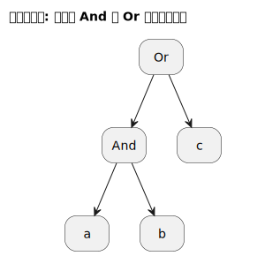
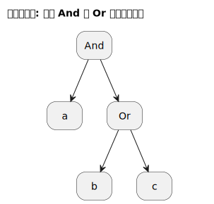

[返回目录](../index.md)

# 语法分析

语法分析是将词素序列转为抽象语法树(Abstract syntax tree)的过程

在自然语言, 比如英语中, 有5种基本句型:

- `主语 + 不及物动词`
- `主语 + 及物动词 + 宾语`
- `主语 + 及物动词 + 间宾 + 直宾`
- `主语 + 及物动词 + 宾语 + 补语`
- `主语 + 系动词 + 补语`

我们选取其中一种句型作为例子, 我们可以说: "一个英语句子可以由主谓宾构成", 于是我们把这句话写作如下形式:

```txt
句子 -> 主语 + 及物动词 + 宾语
```

接下来, 我们会问, 主语是什么? 答案可写作如下形式:

```txt
主语 -> 名词 | 名词性子句 | 动名词 | 不定式
```

下一个问题, 及物动词是什么? 答案是, 其已经是最小单元, 不可被继续推导, 被称作 **终结符(Terminal)**, 是一个词素.

宾语是什么? 答案是, 可充当主语的都可以充当宾语.

于是最后, 对于主谓宾句式, 我们可设计出如下**文法(Grammar)**:

```txt
句子 -> 主语 + 及物动词 + 宾语
主语 -> 名词性成分 
宾语 -> 名词性成分
名词性成分 -> 名词 | 名词性子句 | 动名词 | 不定式
```

事实上,这个文法不完全, 因为还可以继续追问下去, "名词性子句是什么?", "动名词、不定式是什么?"...

你会发现, 设计英语文法的过程, 就是一个自顶向下推导的过程. 通过这个过程, 确定了所有的 **非终结符(Non Terminal)** 的组成, 也即确定了**产生式(Production)**.

> “非终结符”是指可以继续推导的符号, 比如上例中的 主语、宾语、名词性子句等, 这些可以继续追问它们的构成; 而与之对应, 终结符则是指不可继续推导, 即不可继续追问其构成的符号, 比如一个名词、形容词、副词, 这些已经是最小单元了, 推导到这里就可以终结了, 故称“终结符”.
>

## 设计正则文法

在实践中, 设计文法既可以自顶向下, 也可反过来自底向上. 甚至可以不用演绎法, 而用归纳法.

在前面的词法分析中, 我们将词素(后称终结符) 分为了两类:

1. 匹配字符
2. 控制字符

更进一步归纳:

1. 匹配字符
2. 控制字符
   1. 控制前面的字符(也可以是括号里的一个嵌套的表达式)重复多少次,如 `*`、`?`
   2. 或,前面的字符(也可以是括号里的一个嵌套的表达式)和后面的之间,二者取其一,即 `|`
   3. 与,正则表达式里默认有“与”的的关系, 我们用符号 `&` 表达这种隐式关系

继续归纳:

1. 匹配字符
2. 一元表达式,`*`、`?`、`+`、`{m,n}`
3. 二元表达式, `|`,`&`

观察以上4项,一个直觉上的规律是,后面的依次由前面的组成,于是得到如下文法:

```bnf
primary_expr -> single_literal | '(' expr ')'   //基本词素
unary_expr -> primary_expr | primary_expr '*'  //一元表达式
binary_expr ->
    unary_expr
    |
    unary_expr '｜' binary_expr		//或
    |
    unary_expr binary_expr		// 与
expr -> binary_expr	//正则表达式
```

## 正则文法中的优先级

直觉通常可以帮助解决问题的大部分,但是有时还需要有一个纠错过程. 如上文法,没有体现出 And 表达式 与 Or 表达式的优先级,对于输入 `ab|c` 将生成错误的语法树:



为了让 Or 优先结合,需要将`binary_expr`拆分,Or 表达式提升为独立的非终结符,放到 And 前面:

```c
primary_expr -> single_literal | '(' expr ')' //基本词素
unary_expr -> primary_expr | primary_expr '*'	//一元
or_expr ->	
    unary_expr
    |
    unary_expr '｜' or_expr	//或
and_expr ->
    or_expr
    |
    or_expr and_expr	//与
expr -> and_expr //正则表达式
```



## 语法分析的编码实现

语法分析的实现有两种选择——基于 parser generater 代码生成, 或手写递归下降, 基于 LR 的 Parser 分析能力会更强(如支持左递归文法), 而手写递归下降则更便于控制.

在手写递归下降时, 一个经验指导是, 设计文法时标清晰地标记出每个产生式的 Follow 集. 因为我们编码时每个非终结符对应的分析函数需要明确,何时应当 **归约(Reduce)** (方法返回), 何时应该 **移入(Shift)** (方法循环,继续读取下一个词素).

对于 `or_expr`,当分析出一个 `unary_expr` 后, 如果 `lookahead='|'` 则选择移入, 否则归约.

```c
or_expr ->	
    unary_expr {Reduce ELSE}
    |
    unary_expr {Shift if lookahead is '|' } '｜' or_expr	//或
```

对于 `and_expr`, 其 Follow 集为 `{EOF,')'}` ,所以当分析出一个 `or_expr` 后, 如果 `lookahead in EOF,')'` 则归约, 否则移入.

```c
and_expr ->
    or_expr {Reduce if lookahead in EOF,')'}  
    |
    or_expr and_expr	//与
```
